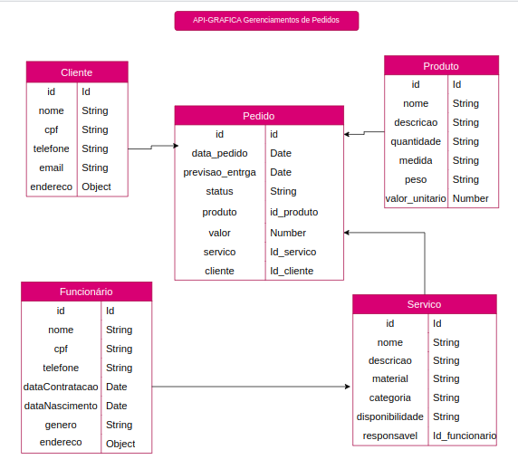
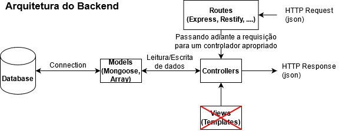

# API Gráfica Gerenciamento de Pedidos

Esta é uma API gráfica para gerenciamento de pedidos, permitindo a criação, atualização, consulta e exclusão de pedidos. A API fornece endpoints para manipulação de dados de pedidos, clientes e produtos.

## Modelagem de Dados

### Diagrama de Modelagem



O sistema é composto pelas seguintes entidades:

1. **Funcionário**
2. **Cliente**
3. **Produto**
4. **Pedido**
5. **Serviço**

## Arquitetura
A API será construída utilizando Node.js e Express.js, com o banco de dados MongoDB hospedado no MongoDB Atlas. A configuração do ambiente será gerenciada com o dotenv e a validação de dados será feita com o Yup.



## Funcionalidades Principais

1. **Buscar Todos**:
   - Cada entidade possui um endpoint GET que retorna todos os registros daquela entidade.
   - Exemplos:
     - `GET /funcionarios`: Retorna a lista de todos os funcionários cadastrados.
     - `GET /clientes`: Retorna a lista de todos os clientes cadastrados.
     - `GET /produtos`: Retorna a lista de todos os produtos disponíveis.
     - `GET /pedidos`: Retorna a lista de todos os pedidos realizados.
     - `GET /servicos/`: Retorna a lista de todos os servico realizados.

2. **Buscar por ID**:
   - Permite buscar um registro específico de uma entidade pelo seu ID.
   - Exemplos:
     - `GET /funcionarios/{id}`: Retorna as informações do funcionário com o ID especificado.
     - `GET /clientes/{id}`: Retorna as informações do cliente com o ID especificado.
     - `GET /produtos/{id}`: Retorna as informações do produto com o ID especificado.
     - `GET /pedidos/{id}`: Retorna as informações do pedido com o ID especificado.
     - `GET /servico/{id}`: Retorna as informações do servico com o ID especificado.

3. **Criar**:
   - Permite criar um novo registro em uma entidade.
   - Exemplos:
     - `POST /funcionarios`: Cria um novo funcionário no sistema.
     - `POST /clientes`: Adiciona um novo cliente ao sistema.
     - `POST /produtos`: Adiciona um novo produto ao catálogo.
     - `POST /pedidos`: Cria um novo pedido para um cliente, incluindo os itens de pedido.
     - `POST /servicos`: Cria um novo servico para um cliente.

4. **Atualizar**:
   - Permite atualizar as informações de um registro existente em uma entidade.
   - Exemplos:
     - `PUT /funcionarios/{id}`: Atualiza as informações do funcionário com o ID especificado.
     - `PUT /clientes/{id}`: Atualiza as informações do cliente com o ID especificado.
     - `PUT /produtos/{id}`: Atualiza as informações do produto com o ID especificado.
     - `PUT /pedidos/{id}`: Atualiza as informações do pedido com o ID especificado.
     - `PUT /servicos/{id}`: Atualiza as informações do servico com o ID especificado.

5. **Deletar**:
   - Permite excluir um registro de uma entidade pelo seu ID.
   - Exemplos:
     - `DELETE /funcionarios/{id}`: Remove o funcionário com o ID especificado do sistema.
     - `DELETE /clientes/{id}`: Remove o cliente com o ID especificado do sistema.
     - `DELETE /produtos/{id}`: Remove o produto com o ID especificado do catálogo.
     - `DELETE /pedidos/{id}`: Remove o pedido com o ID especificado do sistema.
     - `DELETE /servicos/{id}`: Remove o servico com o ID especificado do sistema.


## Envio de E-mails com Nodemailer

A API também possui a funcionalidade de envio de e-mails utilizando o [Nodemailer](https://nodemailer.com/about/). Quando um pedido é criado, um e-mail é enviado para o e-mail da gráfica contendo os detalhes do pedido.

### Configuração do Nodemailer

Para permitir que a aplicação envie e-mails usando o Nodemailer e uma conta do Gmail, siga os passos abaixo:

1. **Habilite a Verificação em Duas Etapas** na sua Conta do Google.
2. **Crie uma Senha de Aplicativo**:
   - Acesse [Minha Conta Google](https://myaccount.google.com/security).
   - Em "Como fazer login no Google", clique em "Senhas de Aplicativos".
   - Digite "Nodemailer" no campo "Nome do app" e clique em "Gerar".
   - Copie a senha gerada.

3. **Configure as Variáveis de Ambiente**:
   - Adicione as seguintes variáveis ao seu arquivo `.env`:

   ```env
   EMAIL_USER=youremail@gmail.com
   EMAIL_PASS=your_app_specific_password


# Instalação
1. Clone este repositório:
    ```sh
    git clone <URL_DO_REPOSITORIO>
    ```
2. Instale as dependências:
    ```sh
    npm install
    ```
3. Configure as variáveis de ambiente no arquivo `.env`:
    ```env
    MONGODB_URI=<sua_url_mongodb_atlas>
    PORT=<porta_da_aplicação>
    ```
4. Inicie a aplicação:
    ```sh
    npm start
    ```
